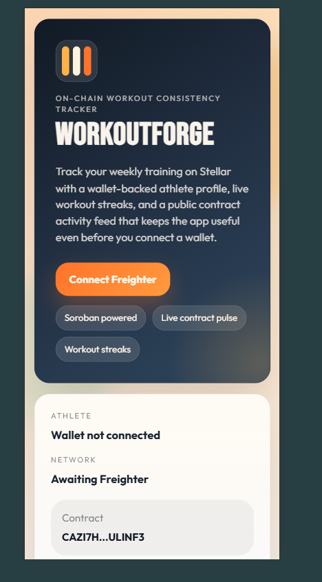

# WorkoutForge

[](https://github.com/Aryaaa-21/Workout/actions/workflows/ci.yml)

WorkoutForge is a Stellar Soroban mini-dApp for tracking workout consistency on-chain. Athletes connect a Freighter wallet, create a public profile, set a weekly workout-minute goal, log workout sessions, and view a live contract activity feed backed by recent Soroban events from the deployed contract.

## Live Demo

- Public GitHub repository: `https://github.com/Aryaaa-21/Workout`
- Live deployed app: `https://workoutforge-ledger-frontend.vercel.app`
- Latest production deployment: `https://workoutforge-ledger-frontend-10lag1nq2.vercel.app`
- Demo video: [WorkoutForge walkthrough](https://drive.google.com/file/d/1OZidabAbTpQbPzAWuHWJCuFjaiRoVYAb/view?usp=sharing)

## Submission Proof

### Screenshots





### CI/CD Pipeline

- GitHub Actions workflow: `https://github.com/Aryaaa-21/Workout/actions/workflows/ci.yml`
- Badge above reflects the current CI state for the default branch
- CI checks run:
  - `npm ci`
  - `cargo test --locked`
  - `cargo build --locked --target wasm32v1-none --release -p workout_forge`
  - `npm run lint`
  - `npm run build:frontend`

## Project Overview

WorkoutForge focuses on one Soroban contract and a production-ready React frontend:

- Wallet-backed athlete profiles stored on Soroban
- Weekly minute goals with validation and update flows
- Workout logging with streak tracking and weekly resets
- Live contract activity feed backed by Soroban RPC `getEvents`
- Weekly-goal achievement event emitted on the exact threshold-crossing workout
- Responsive UI deployed to Vercel

## Architecture

### Soroban Contract

Contract name: `WorkoutForge`

Methods:

- `save_profile(athlete, display_name, weekly_goal_minutes)`
- `update_weekly_goal(athlete, new_goal_minutes)`
- `log_workout(athlete, workout_type, minutes_spent)`
- `get_dashboard(athlete)`
- `get_session_count(athlete)`
- `get_session(athlete, index)`
- `has_profile(athlete)`

Emitted events:

- `profile_saved`
- `weekly_goal_updated`
- `workout_logged`
- `weekly_goal_reached`

### Frontend

- React + Vite
- Freighter wallet integration
- Soroban RPC reads and writes through `@stellar/stellar-sdk`
- React Query for cached reads and auto-refreshing activity data
- Lazy-loaded Stellar SDK to reduce the initial bundle

## Deployment Details

- Network: `Stellar Testnet`
- Contract alias: `workout_forge`
- Contract ID: `CAZI7HJCJTUX75LYXZSMBQ2WEHAVBQ4AYYGVME5Y7SVTRYSBGLULINF3`
- Contract explorer: `https://lab.stellar.org/r/testnet/contract/CAZI7HJCJTUX75LYXZSMBQ2WEHAVBQ4AYYGVME5Y7SVTRYSBGLULINF3`
- Deployment record: [deployments/testnet.json](./deployments/testnet.json)

Sample testnet transactions:

- Profile creation transaction: `https://stellar.expert/explorer/testnet/tx/6744fad42487a70ba8f4aad6d5e2d1fbda64d5202c406c1d891f52f9a2bc219a`
- Workout logging transaction: `https://stellar.expert/explorer/testnet/tx/0c0527599f2e626454fb53c4e1e4b4f411e0da44359c814212ddffaed32012d6`

### Inter-Contract Calls

This submission does **not** use inter-contract calls. WorkoutForge is intentionally a single-contract app, and the Level 4 upgrade is delivered through richer contract events and live event streaming instead of adding artificial cross-contract complexity.

### Custom Token / Pool

This submission does **not** deploy a custom token or liquidity pool. There is therefore no token address or pool address to report for this project.

## Local Setup

### 1. Install dependencies

```powershell
npm install
```

### 2. Configure environment

Copy `.env.example` to `.env`:

```env
STELLAR_ACCOUNT=alice
STELLAR_NETWORK=testnet
STELLAR_CONTRACT_ALIAS=workout_forge
VITE_STELLAR_RPC_URL=https://soroban-testnet.stellar.org
VITE_STELLAR_NETWORK_PASSPHRASE=Test SDF Network ; September 2015
VITE_CONTRACT_ID=CAZI7HJCJTUX75LYXZSMBQ2WEHAVBQ4AYYGVME5Y7SVTRYSBGLULINF3
```

### 3. Start the frontend

```powershell
npm run dev
```

Then open the Vite URL and connect Freighter on `Stellar Testnet`.

## Build, Test, and Deploy

### Run contract tests

```powershell
npm run contract:test
```

### Build the contract wasm directly

```powershell
npm run contract:wasm
```

### Build with Stellar CLI

```powershell
npm run contract:build
```

### Deploy to Stellar Testnet

```powershell
npm run contract:deploy
```

This writes the deployment record to `deployments/testnet.json`.

### Export frontend contract config

```powershell
npm run export:frontend
```

### Lint the frontend

```powershell
npm run lint
```

### Build the frontend bundle

```powershell
npm run build:frontend
```

### Deploy the frontend to Vercel

```powershell
npm run deploy:frontend
```

The repository is already linked to the Vercel project `workoutforge-ledger-frontend`.

## Vercel Configuration

Root `vercel.json`:

- Install command: `npm install`
- Build command: `npm run build:frontend`
- Output directory: `frontend/dist`

Required Vercel environment variables:

- `VITE_STELLAR_RPC_URL`
- `VITE_STELLAR_NETWORK_PASSPHRASE`
- `VITE_CONTRACT_ID`

Recommended values:

```env
VITE_STELLAR_RPC_URL=https://soroban-testnet.stellar.org
VITE_STELLAR_NETWORK_PASSPHRASE=Test SDF Network ; September 2015
VITE_CONTRACT_ID=CAZI7HJCJTUX75LYXZSMBQ2WEHAVBQ4AYYGVME5Y7SVTRYSBGLULINF3
```

## Verification Steps

1. Open the live app: `https://workoutforge-ledger-frontend.vercel.app`
2. Confirm the public activity feed loads without a wallet
3. Connect Freighter on Stellar Testnet
4. Create or update a profile
5. Log a workout and verify:
   - the dashboard updates
   - the recent workouts panel refreshes
   - the public Soroban activity feed refreshes with the new event
6. Inspect the transaction link shown in the status banner
7. Confirm GitHub Actions passes on the latest `main` push

## Project Structure

```text
contracts/workout_forge/
frontend/
scripts/
deployments/
assets/
.github/workflows/
Cargo.toml
package.json
README.md
```

## Notes

- Freighter must be installed in the browser to submit transactions from the frontend.
- The app remains useful without a wallet because the live contract feed is public.
- The contract config export is stable and does not rewrite timestamps unnecessarily when the deployment record is unchanged.
