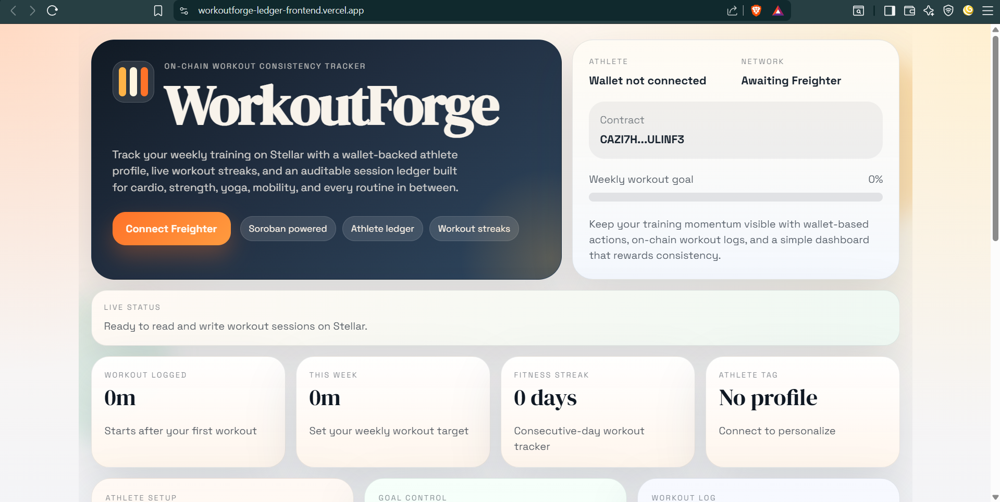
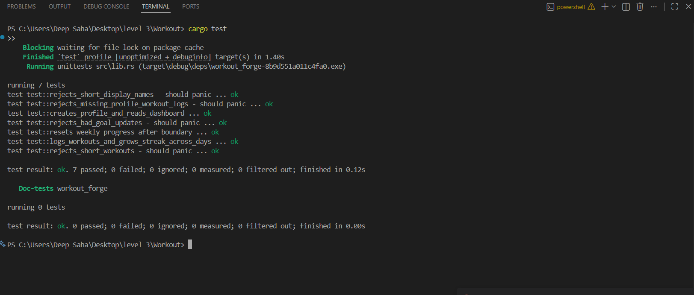

# WorkoutForge

WorkoutForge is a Stellar Soroban mini-dApp for tracking workout consistency on-chain. Athletes connect a Freighter wallet, create a public profile, set a weekly workout-minute goal, and log individual workout sessions that update weekly progress and active streak data.

## Submission Links

- Live deployed app: `https://workoutforge-ledger-frontend.vercel.app`
- Demo video: [WorkoutForge demo walkthrough](https://drive.google.com/file/d/1OZidabAbTpQbPzAWuHWJCuFjaiRoVYAb/view?usp=sharing)
- Contract page: `https://lab.stellar.org/r/testnet/contract/CAZI7HJCJTUX75LYXZSMBQ2WEHAVBQ4AYYGVME5Y7SVTRYSBGLULINF3`
- Testnet transaction 1: `https://stellar.expert/explorer/testnet/tx/d49c1b86a7577d61da3801bc278e6b4979fa64990bf6def77c405609ad29c2a0`
- Testnet transaction 2: `https://stellar.expert/explorer/testnet/tx/74066eb14b5115be326cc52333ec5a5019a741c43a900b057877c690f345c924`

## UI Preview



## Demo Recording

[Watch the WorkoutForge walkthrough video](https://drive.google.com/file/d/1OZidabAbTpQbPzAWuHWJCuFjaiRoVYAb/view?usp=sharing)

## Deployment Details

- Network: `Stellar Testnet`
- Contract alias: `workout_forge`
- Contract ID: `CAZI7HJCJTUX75LYXZSMBQ2WEHAVBQ4AYYGVME5Y7SVTRYSBGLULINF3`
- Contract explorer: `https://lab.stellar.org/r/testnet/contract/CAZI7HJCJTUX75LYXZSMBQ2WEHAVBQ4AYYGVME5Y7SVTRYSBGLULINF3`
- Deployment timestamp: `2026-04-22T13:42:17.103Z`

## What The App Does

Users can:

- Connect a Freighter wallet
- Create or update an athlete profile
- Set a weekly workout goal in minutes
- Log workout sessions on-chain
- Track total minutes, weekly progress, and active streaks
- Review recent workouts pulled from the deployed contract

## Stack

- Smart contract: Rust + Soroban SDK
- Contract tooling: Stellar CLI
- Frontend: React + Vite
- Wallet: Freighter
- Network access: Soroban RPC via `@stellar/stellar-sdk`
- Data fetching: TanStack Query

## Project Structure

```text
contracts/workout_forge/
frontend/
scripts/
assets/
Cargo.toml
package.json
README.md
```

## Contract Features

The Soroban contract stores:

- An athlete profile per Stellar address
- Individual workout sessions by index
- Weekly workout progress totals
- Consecutive-day workout streaks

Contract methods:

- `save_profile(athlete, display_name, weekly_goal_minutes)`
- `update_weekly_goal(athlete, new_goal_minutes)`
- `log_workout(athlete, workout_type, minutes_spent)`
- `get_dashboard(athlete)`
- `get_session_count(athlete)`
- `get_session(athlete, index)`
- `has_profile(athlete)`

Validation rules:

- Display name: `3-32` chars
- Workout type: `3-48` chars
- Workout minutes: `5-480`
- Weekly goal: `30-5000` minutes

## Local Setup

### 1. Install dependencies

```powershell
npm install
```

### 2. Run contract tests

```powershell
npm run contract:test
```

### 3. Build the Soroban contract

```powershell
npm run contract:build
```

This outputs:

```text
target/wasm32v1-none/release/workout_forge.wasm
```

### 4. Configure environment

Copy `.env.example` to `.env` and set a Stellar CLI identity:

```env
STELLAR_ACCOUNT=alice
STELLAR_NETWORK=testnet
STELLAR_CONTRACT_ALIAS=workout_forge
VITE_STELLAR_RPC_URL=https://soroban-testnet.stellar.org
VITE_STELLAR_NETWORK_PASSPHRASE=Test SDF Network ; September 2015
VITE_CONTRACT_ID=
```

For the deployed testnet instance in this repo, you can set:

```env
VITE_CONTRACT_ID=CAZI7HJCJTUX75LYXZSMBQ2WEHAVBQ4AYYGVME5Y7SVTRYSBGLULINF3
```

### 5. Start the frontend locally

```powershell
npm run dev
```

Then open the Vite URL and connect Freighter on `Stellar Testnet`.

## Deploy To Stellar Testnet

### 1. Create and fund a testnet identity

```powershell
stellar keys generate alice --network testnet --fund
```

### 2. Build the contract

```powershell
npm run contract:build
```

### 3. Deploy the contract

```powershell
npm run contract:deploy
```

The deploy script wraps:

```powershell
stellar contract deploy `
  --wasm target/wasm32v1-none/release/workout_forge.wasm `
  --source-account alice `
  --network testnet `
  --alias workout_forge
```

After deployment it writes:

```text
deployments/testnet.json
```

### 4. Export frontend config

```powershell
npm run export:frontend
```

That updates:

```text
frontend/src/lib/contract-config.js
```

## Production Build

```powershell
npm run build
```

This will:

1. Build the Soroban contract
2. Export the frontend config
3. Build the React app into `frontend/dist`

## Vercel Deployment

The frontend is deployed on Vercel.

- Live frontend: `https://workoutforge-ledger-frontend.vercel.app`
- Install command: `npm install`
- Build command: `npm run build:frontend`
- Output directory: `frontend/dist`

Set these Vercel environment variables:

- `VITE_STELLAR_RPC_URL`
- `VITE_STELLAR_NETWORK_PASSPHRASE`
- `VITE_CONTRACT_ID`

Recommended testnet values:

```env
VITE_STELLAR_RPC_URL=https://soroban-testnet.stellar.org
VITE_STELLAR_NETWORK_PASSPHRASE=Test SDF Network ; September 2015
VITE_CONTRACT_ID=CAZI7HJCJTUX75LYXZSMBQ2WEHAVBQ4AYYGVME5Y7SVTRYSBGLULINF3
```

## Verification

Completed local checks:

- `npm run contract:test`
- `npm run build`
- `npm run contract:deploy`
- `npm run export:frontend`
- Vercel production deploy to `https://workoutforge-ledger-frontend.vercel.app`

### Contract Test Output



## Notes

- Freighter must be installed in the browser to submit transactions from the frontend.
- If Brave blocks Freighter injection on localhost, Chrome or Edge may be more reliable for the demo flow.
- The GitHub CLI currently has `barish245` authenticated locally; pushing under `Aryaaa-21` requires that account to be authenticated in `gh` first.
